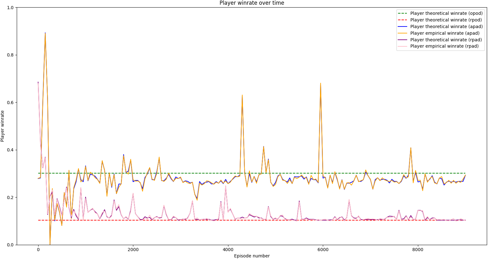

# Analyzing Skill Expression in Games
This is a repo where I describe a method to measure the amount of skill expression games have.

## Table of Contents
* [Motivation](#motivation)
* [Defining Skill](#defining-skill)
* [Skill Score](#skill-score)
* [Explicitly Calculating Skill Score](#explicitly-calculating-skill-score)
* [Approximating Skill Score](#approximating-skill-score)
* [Single-Player Blackjack](#single-player-blackjack)
* [Generalizing Skill Score for Multi-Player Games](#generalizing-skill-score-for-multi-player-games)
* [Two-Player Blackjack](#two-player-blackjack)
* [Conclusion](#conclusion)
* [Open Discussions](#open-discussions)
* [File Descriptions](#file-descriptions)

## Motivation
A friend of mine is a board game designer and described a thesis he had to me: 

***Games that incorporate random chance elements can allow less-skilled players to occasionally beat better-skilled players. There exists an optimal balance between the win rates of the less-skilled players and the better-skilled players, that make a game popular.***

As a consequence, games that never allow less-skilled players to beat better-skilled players, would make casual players less inclined to play those games. On the other hand, games that allow less-skilled players to beat better-skilled players too often would give the impression to the players that their choice of actions have little to no effect on the outcome of the game; i.e. the game gives players very little **skill expression**.

My friend was pondering whether there was an objective way of quantifying this win rate balance (i.e. the chance of a less-skilled player beating a better-skilled player) for board games. If such a method existed, then one can calculate this measurement across many board games and see whether there is a trend between the popularity of a game and its win rate balance between less-skilled and better-skilled players. And if such a trend exists, then that could help in designing future board games that will be popular with the general public.

Personally I'm a big fan of games in general, and so I found the problem very interesting and started brainstorming some ideas. After some thought, I formulated a possible solution for calculating this win rate balance measurement.

## Defining Skill
The distinction between less-skilled players and better-skilled players is the win rate. Better-skilled players are expected to win more often than less-skilled players. 

To get a measure of how much skill matters in a game (i.e. how much does skill affect the win rate in a game), we need to take a look at both ends of the skill spectrum: players with maximum skill and players with no skill. 

A player with maximum skill will always pick the optimal action that maximizes their chance of winning the game; such a player therefore plays an **optimal strategy** and is deemed an **optimal player**.

A player with no skill is a little bit harder to define. In this project, I define a player with no skill as a player that implements a **random strategy** (i.e. the player always picks random actions) and is thus deemed a **random player**. In the [Open Discussions](#is-it-fair-to-assume-that-a-no-skill-player-is-equivalent-to-a-random-player) section, I go over some consequences of defining a no-skill player this way.

By comparing the win rates of a player with maximum skill (an optimal player) and a player with no skill (a random player), we can measure the maximum effect that skill has in affecting the win rate in a particular game.

## Skill Score
Let's first start with single-player games as an example (e.g. blackjack, solitaire, free cell etc.).

Suppose an optimal player plays a single-player game and ends up with a 60% win rate, averaged over trillions of games. Now suppose a random player plays the same single-player game where it only picks random actions and ends up with a 20% win rate. Therefore in this specific example, we see that using a no-skill, random strategy can account for up to a third of the win rate of the optimal strategy. On the flip side, we can say that the remaining two-thirds of the optimal win rate can indeed be attributed to skill. I call this two-thirds value, the **skill score**:

where  is the skill score,  is the win rate of the random strategy and  is the win rate of the optimal strategy.

In this example, we can see that a major portion of the win rate of the optimal player can be attributed to that player's skill.

Now imagine that instead of 20%, the random player achieves a 60% win rate as well. Then in this case, we can see that using a no-skill, random strategy can account for the total win rate of the optimal strategy. In other words, we can say that none of the games won by the optimal strategy can be attributed to skill. Therefore the skill score is 0.

Finally, if the random player achieves a 0% win rate, then we can conclude that using a no-skill, random strategy accounts for none of the win rate of the optimal strategy. And therefore, we can see that all the games won by the optimal strategy can be attributed solely to skill. Therefore the skill score is 1.

**Intuitively, the skill score is a measurement from 0 to 1 that measures the skill expression of a game; i.e. how much skill affects the outcome of the game**. A skill score of 0 means that the outcome of the game is not determined by skill at all, whereas a skill score of 1 means that the outcome of the game is determined purely by skill. A number in-between means that the outcome of the game is determined partially by skill. **More precisely, the mathematical definition of the skill score for a game is the maximum proportion of a player's win rate that can be attributed to skill**. In the [Open Discussions](#how-useful-is-skill-score) section, I go over some more details regarding the mathematical definition of skill score.

Comparing the skill scores of different games will give us an idea of which games are more affected by skill or less affected by skill. If the win rate of a player with no skill (i.e. a player using the random strategy) becomes further and further away from the win rate of a player with maximum skill (i.e. a player using the optimal strategy), then intuitively the game's outcomes are more affected by skill; i.e. a higher skill score. If the win rate of a player with no skill becomes closer and closer to the win rate of a player with maximum skill, then intuitively the game's outcomes are less affected by skill; i.e. a lower skill score.

An example of a game with a skill score of 0 is guessing a coin flip; the win rate of the random strategy is 50%, which is also the win rate of the optimal strategy.

Note: the win rate of an optimal player will always be at least equal to the win rate of the random player (in the case where the win rates are equal, that would imply that the optimal strategy for the game is the random strategy)

## Explicitly Calculating Skill Score
To calculate the skill score of a game, we need the win rate of the random strategy () and the win rate of the optimal strategy ().

### Calculating the Random Win Rate
We can calculate the win rate of the random strategy **for a given game state** by:
* considering all possible moves the player can make right now
* considering all possible future game states that will result from making all possible player moves
* repeat the first two steps on the future game states, until all the resulting game states are terminal (i.e. the game has ended)
* look at all the terminal game states and see which games have resulted in a win for the player
* for each terminal game state that resulted in a win, calculate the probability of getting to that particular terminal game state by:
	* looking at the sequence of actions and intermediate game states that we took to get from the given game state to the particular terminal game state
	* multiplying the probabilities of choosing those specific actions (from the random strategy) and the probabilities of getting to those resulting intermediate game states together
* add the probabilities of getting to each terminal game state that resulted in a win together, to get the total probability of winning the game using the random strategy from the given game state

We can then calculate the win rate of the random strategy **for the entire game** by:
* considering all possible initial game states the game can start in
* calculating the win rate of the random strategy for each possible initial game state (using the above algorithm)
* for the calculated win rate of each initial state, multiply by the probability of starting in the corresponding initial state
* add all of the win rate probabilities together to get the total probability of winning the game using the random strategy ()

### Calculating the Optimal Win Rate
Assuming we don't know what the optimal strategy is, how can we calculate the optimal win rate of a game? We can first calculate the optimal win rate for a given game state, by using the same algorithm used for calculating the random win rate for a given state, with some slight alterations. 

The difference is that when we are calculating the probability of getting to each particular terminal game state that resulted in a win, we don't multiply the probabilities of choosing the specific actions like we did for the random strategy. Given  choices for actions, the random strategy will pick to do each action  of the time, whereas the optimal strategy will always pick to do the same optimal action 100% of the time. Thus to get the probability of getting to each particular terminal game state that resulted in a win, we simply multiply the probabilities of getting to the resulting intermediate game states that eventually lead to the terminal game state.

Now given the probabilities of reaching each terminal game state that resulted in a win, we simply take the path that has the highest probability of resulting in a win. This maximum probability is the total probability of winning the game using the optimal strategy from the given game state.

Once we can calculate the optimal win rate for a given state, we can use the second algorithm described above to calculate the optimal win rates for each initial state, multiply them by the probability of each corresponding initial state occurring, and then add them together to get the total probability of winning the game using an optimal strategy ().

### Calculating Skill Score
Once we have both the random win rate () and optimal win rate (), we can calculate the skill score of the game:

## Approximating Skill Score
Explicitly calculating the skill score is a computationally expensive procedure, as it involves enumerating all possible game sequences. For more complex games like chess (with 1043 possible board positions) and Go (with 10170 possible board positions, which is more than the number of atoms in the universe), this method becomes infeasible.

Instead of explicitly calculating the win rates, we can instead use approximations via game sampling. The random win rate can be approximated by playing many games using the random strategy and seeing how many games were won, divided by the number of games played.

We'd like to do  a similar approximation to get the optimal win rate, but what if we don't know what the optimal strategy is? We can instead train an AI agent to learn an approximation of the optimal strategy, using reinforcement learning. Then  the optimal win rate can be approximated by playing many games using the AI agent's learned strategy and seeing how many games were won, divided by the number of games played.

We can then calculate an approximation to the skill score as such:

where  is an approximation of the random win rate obtained by playing many games using the random strategy, and  is an approximation of the optimal win rate obtained by playing many games using the AI agent's learned strategy.

## Single-Player Blackjack

### Game Rules
We'd like to see how the approximation of the skill score compares to the true value. We'll be using a simplified version of a single-player blackjack game as an example. The simplicity allows the calculation of the true theoretical skill score to be possible.

In this game, there is a player and a dealer. The deck consists of 8 cards numbered from 1 to 4, with two copies of each card. The player is dealt two cards face-up and the dealer is dealt one card face-up. 

The goal of the player is to have the sum of their hand be higher than the sum of the dealer's hand. Each game, the player decides whether they want to add a card from the deck to their hand (i.e. if they want to **hit**). At any point if the sum of the player's hand is greater than 8, the player loses (i.e. the player **busts**). 

Once they don't want to hit any further, the player then passes the turn over to the dealer (i.e. the player **stays**), and then the dealer hits until the sum of their hand reaches or exceeds 6. At any point if the sum of the dealer's hand is greater than 8, the player wins (i.e. the dealer busts). 

If the sum of the dealer's hand is between 6 and 8, then the sum of the dealer's hand is compared to the sum of the player's hand. If the sum of the player's hand is higher than the sum of the dealer's hand, the player wins. Otherwise, the player loses (meaning the dealer wins ties).

### Experiment procedure
First we explicitly calculate the theoretical random and optimal win rate of this blackjack game. We then train an AI agent to learn to play this game, with the goal of maximizing its win rate. While the AI agent is training, we can periodically evaluate the win rate of its current learned strategy in two ways: explicitly calculating it using the [algorithm](#explicitly-calculating-skill-score) mentioned previously, and [approximating](#approximating-skill-score) it using game sampling. 

Once the AI agent is done training, we assume that the strategy it learned is an approximation of the optimal strategy. We can then use game sampling to get an approximation of the theoretical optimal win rate using the AI agent's learned strategy. We also can get an approximation of the random win rate by sampling games using the random strategy. Once we have approximated values for both the optimal and random win rate, we can calculate an approximation of the skill score for this game.

### Experiment results

Above is a graph that plots the win rate of the AI agent's strategy as it trains, in comparison to the theoretical optimal win rate and random win rate. 

The theoretical optimal win rate is 42.381% and is denoted by the green dotted line. This represents an upper bound as the highest possible win rate a player can achieve given the rules of this game.

The theoretical random win rate is 18.899% and is denoted by the red dotted line. Under the assumption that a no-skill player uses a random strategy, this represents a lower bound as the lowest possible win rate a player can achieve given the rules of this game, if the player has a non-negative amount of skill.

Given the theoretical random and optimal win rate, we can then calculate the theoretical skill score:

The theoretical win rate of the AI agent's strategy was calculated using an [algorithm](#explicitly-calculating-skill-score) similar to the one mentioned previously; we evaluate the AI agent's current strategy on all possible game states and calculate what its win rate is. These values are denoted by the blue line.

The empirical win rate of the AI agent's strategy is approximated using game sampling. 10000 games were played using the AI agent's current strategy and the win rate was approximated by dividing the number of wins by 10000 (the AI agent's strategy is locked during this time, and so the AI agent isn't learning during these evaluation games). These values are denoted by the orange line. For more complex games, calculating the theoretical win rate of the AI agent's strategy would be infeasible, so the only option would be to approximate the win rate using game sampling. Therefore we hope to see the empirical win rate closely approximate the theoretical win rate of the AI agent's strategy.

After 5000 games of training, we evaluate the win rate of the AI agent's current learned strategy as well as the win rate of the random strategy via game sampling. The empirical win rate of the AI agent's strategy is 40.84% and the empirical win rate of the random strategy is 18.3% (denoted by the pink line). 

Therefore given the empirical approximation of the random and optimal win rate, we can then calculate the approximation of the skill score:

Therefore using the empirical win rate of the AI agent's learned strategy to approximate the theoretical optimal win rate, and using the empirical win rate of the random strategy to approximate the theoretical random win rate, gives us a good approximation of the skill score.

## Generalizing Skill Score for Multi-Player Games
Let's think about how we would go about calculating skill score for a multi-player game. The first questions that arise with multi-player games are: 
* Is the game adversarial or cooperative?
* Are the player roles uniform, or are there different types of player roles?
* As a consequence, are the win rates for all of the player roles the same or different?
* How do you calculate the optimal and random win rate in a multi-player game?

It is clear that if there are different types of player roles in a game (i.e. not all player roles can do the same actions, have access to the same resources, have the same winning conditions, etc.), then it's possible for different player roles to have different chances of winning the game. To make this distinction, **there therefore must be a separate optimal and random win rate associated for each player role**. Thus for every player role   in a game, there is a corresponding skill score defined as:

where  is the random win rate and  is the optimal win rate of the player role .

How do we calculate the optimal and random win rate of a specific player role ? Given a fixed strategy for this specific player role, the win rate would change depending on what strategies are implemented by all the other player roles.

Imagine in a two-player game where the first player implements a random strategy while the second player implements both an optimal and random strategy and achieves a win rate of 90% and 30% respectively. Using our definition of the skill score, two-thirds of the win rate of the second player can be attributed to skill. But in reality, the second player played against a sub-optimal player, so how much of that two-thirds is really due to the second player's skill, rather than the first player's lack of skill? The answer is not quite clear.

Now let's imagine that the first player also implements an optimal strategy, and the optimal and random win rate of the second player against the optimal first player is now 60% and 20% respectively. Using our definition of the skill score, two-thirds of the win rate of the second player can be attributed to skill. Because the first player is an optimal player, they therefore have maximum skill. Therefore the two-thirds is indeed really due to the second player's skill, since the first player is not lacking in skill.

Therefore in order to quantify the optimal and random win rate for a player role  , we fix all other player roles to implement optimal strategies, such that they are all players of maximum skill. Then calculating the skill score of the player role   would indeed give us the proportion of that player's win rate that we can attribute to specifically that player's skill.

Generalizing to multi-player games, the skill score for each player role can then be defined as a measurement from 0 to 1 that tells you how much skill affects the outcome of the game **for that specific player role**.

## Two-Player Blackjack

### Game Rules
Let's now calculate the skill scores for each player in a two-player game of blackjack. The rules are the same as the single-player version except we add a second player that takes on the role of the dealer. 

The player and dealer are dealt the same amount of cards as before, the player goes first until they bust or stay, in which then the dealer goes next. The difference now is that since the dealer is a player, the dealer is free to stay before they reach 6. In addition, the dealer doesn't have to stay if the sum of their hand reaches or exceeds 6; they can continue hitting if they want. Ties are still won by the dealer.

### Experiment procedure
We want to calculate the skill scores for both the player and dealer role, which means we need their corresponding optimal and random win rates. These can be obtained with the following 3 experiments:
* train an AI player agent to play against an AI dealer agent, where both AI agent's learn to approximate the optimal strategy for its role
* train an AI player agent to play against a random dealer, where the AI player agent learns to approximate the optimal strategy for its role
* train an AI dealer agent to play against a random player, where the AI dealer agent learns to approximate the optimal strategy for its role

In the first experiment, both AI agents learn an optimal strategy given their opponent's strategy. Using the AI player agent's learned strategy as an approximation of the optimal player strategy and the AI dealer agent's learned strategy as an approximation of the optimal dealer strategy, we can calculate the optimal player and optimal dealer win rates.

In the second experiment, the AI player agent learns an optimal strategy against a random dealer. Using the random dealer strategy and the AI player agent's learned strategy as an approximation of the optimal player strategy, we can calculate the random dealer win rate.

In the third experiment, the AI dealer agent learns an optimal strategy against a random player. Using the random player strategy and the AI dealer agent's learned strategy as an approximation of the optimal dealer strategy, we can calculate the random player win rate.

One might be wondering why can't we just re-use the strategies learned by the AI agents in the first experiment to calculate the random win rates for both of the roles. The reason we can't is because the optimal strategy for the player against a random dealer is different than the optimal strategy for the player against an optimal dealer. Likewise, the optimal strategy for the dealer against a random player is different than the optimal strategy for the dealer against an optimal player. Therefore we need to train a separate agent for each role to learn the optimal strategy against its random opponent.

Once we have the approximations of the optimal and random win rate for both roles, we can calculate an approximation of their skill scores respectively. We can then compare them to the true theoretical skill scores for each role.

### Experiment results

In the player win rate graph:
* The theoretical win rate of the **o**ptimal **p**layer strategy (against the **o**ptimal **d**ealer strategy) is 30.079% and is denoted by the green dotted line (**opod**)
* The theoretical win rate of the **r**andom **p**layer strategy (against the **o**ptimal **d**ealer strategy) is 10.327% and is denoted by the red dotted line (**rpod**)
* The theoretical win rate of the **A**I **p**layer agent's strategy (against the **A**I **d**ealer agent's strategy) is denoted by the blue line (**apad**)
* The empirical win rate of the AI player agent's strategy (against the AI dealer agent's strategy) is denoted by the orange line (apad)
	* after 9000 games of training, the empirical win rate of the AI player agent's strategy (against the AI dealer agent's strategy) is 29.57%, approximated by sampling 10000 games
* The theoretical win rate of the **r**andom **p**layer strategy (against the **A**I **d**ealer agent's strategy) is denoted by the purple line (**rpad**)
* The empirical win rate of the random player strategy (against the AI dealer agent's strategy) is denoted by the pink line (rpad)
	* after 9000 games of training, the empirical win rate of the random player agent's strategy (against the AI dealer agent's strategy) is 10.36%, approximated by sampling 10000 games

Therefore the theoretical skill score for the player role is:

And the empirical skill score for the player role is:

In the dealer win rate graph:
* The theoretical win rate of the optimal dealer strategy (against the optimal player strategy) is 69.921% and is denoted by the green dotted line (opod)
* The theoretical win rate of the **r**andom **d**ealer strategy (against the **o**ptimal **p**layer strategy) is 17.083% and is denoted by the red dotted line (**oprd**)
* The theoretical win rate of the AI dealer agent's strategy (against the AI player agent's strategy) is denoted by the blue line (apad)
* The empirical win rate of the AI dealer agent's strategy (against the AI player agent's strategy) is denoted by the orange line (apad)
	* after 9000 games of training, the empirical win rate of the AI dealer agent's strategy (against the AI player agent's strategy) is 70.43%, approximated by sampling 10000 games
* The theoretical win rate of the **r**andom **d**ealer strategy (against the **A**I **p**layer agent's strategy) is denoted by the purple line (**aprd**)
* The empirical win rate of the random dealer strategy (against the AI player agent's strategy) is denoted by the pink line (aprd)
	* after 9000 games of training, the empirical win rate of the random dealer agent's strategy (against the AI player agent's strategy) is 16.86%, approximated by sampling 10000 games

Therefore the theoretical skill score for the dealer role is:

And the empirical skill score for the dealer role is:

Similar to the results of the one-player blackjack experiment, we can see here that approximating the optimal and random win rates for both player roles using AI agents gives us a good approximation of the true skill score for both player roles. Since the dealer role has a higher skill score than the player role, we can then interpret that skill affects the outcome of the game for the dealer role more than the player role.

### Notes and Observations
You might notice that the random win rate for either player is not a constant value all the time (compared to the single-player blackjack experiment). This is because the opponent is an AI agent that has to learn over time an optimal strategy against the random strategy.

In the single-player blackjack game, although the dealer is not considered a player, they implement a strategy as well (albeit a simple one), which is to hit until the sum of their hand reaches or exceeds 6, and then stay otherwise. We know from our previous experiment that the theoretical optimal win rate for the player against this type of dealer is 42.381%. Therefore the win rate of the dealer using this strategy against an optimal player is 57.619%. The win rate for this dealer-limit-6 strategy is also on the graph for reference, represented by the brown dotted line.

We also see the optimal and random win rate of the player drop considerably in the two-player game compared to the one-player game. This isn't surprising as the dealer is expected to win a larger portion of the games since they can use the optimal strategy, which is strictly better than the one they used in the single-player game.

It is interesting to see the skill score of the player role actually go up despite the optimal and random player win rate going down in the two-player game compared to the single-player game. This is due to the fact that playing against the optimal dealer strategy reduces the random player win rate by a bigger factor than the optimal player win rate. As a consequence, a larger portion of the player's win rate is attributed to skill.

## Conclusion
In this project, I present a method to calculate the skill score: a measurement that describes how much skill affects the outcome of a game, for every player role in the game. The method is as follows:
* create a virtual version of the game that can run simulations
* if it's computationally feasible:
	* for every player role in the game:
		* explicitly calculate the optimal and random win rates by enumerating all possible game sequences
		* use the optimal and random win rates to calculate the skill score for this particular player role
* if it's not computationally feasible:
	* train an AI agent for each player role to learn an optimal strategy given that all other players are using an optimal strategy
		* extract the approximated optimal win rate for every player from the AI agents' learned strategies
	* for every player role  in the game:
		* train an AI agent for each other player role to learn an optimal strategy given that this specific player role  is using a random strategy and all other agents are using an optimal strategy
		* extract the approximated random win rate for the player role 
	* use the approximations for the optimal and random win rate to get the approximated skill scores for each player role

## Open Discussions
In this section, I outline some ideas and thoughts I had while brainstorming and working on this project. Some are incomplete, while others are more fully fleshed out; either way, they could potentially be more thoroughly explored in future projects.

### Is this method objective? 
Is the [method](#conclusion) outlined in the conclusion an **objective** way of calculating the skill score; i.e. can we be guaranteed to get the same skill score value every time we apply this method on the same game?

We can get this guarantee if we are explicitly calculating the theoretical skill score. Provided that it's computationally feasible, explicit calculation of the theoretical skill score will always result in the same values for each player role for the same game.

If we are approximating the skill score empirically, we have to look at the AI agents that learn an approximation of the optimal strategy. To guarantee that we can get the same skill score would mean that there needs to be a guarantee that the AI agents learn the optimal policy every time. In my implementation of the AI agents for this project, the agents use a neural network to approximate the value function (i.e. their strategy), and uses the reinforcement learning algorithm, Q-learning, to update its neural network.

Q-learning is theoretically proven to converge to an optimal strategy given infinite time, so long as its value function can approximate any function. A neural network can indeed theoretically approximate any function given enough computational power, but it is not always guaranteed to converge to the global optimum solution; it can converge to a local optimum solution, depending on what the initial parameters of the neural network are.

Therefore, we may get different skill score values if we try to calculate it using the empirical method. In practice, we'd most likely have to run the algorithm multiple times and look at the resulting learned strategies. Even then, we wouldn't know for certain whether the strategy it learned is optimal (if we don't have a theoretical optimal strategy to compare it to, which is impossible to calculate for complex games).

### What happens when the AI agent's learned strategy is sub-optimal?
If the AI agent's strategy is theoretically sub-optimal, then it provides a lower bound of what the skill score of the game can be; as the AI agent's strategy approaches the optimal strategy, the current skill score will approach the true theoretical value of the skill score. 

If the AI agent's strategy is worst than the random strategy, then the skill score will be negative, and will approach negative infinity as the AI strategy win rate approaches zero. In practice, given enough computational power and time, the AI agent will learn a strategy that's better than the random strategy.

### How useful is skill score?
The intuitive definition of the skill score for each player role is a measurement from 0 to 1 that tells you how much skill affects the outcome of the game for that specific player role. "How much skill affects the outcome of the game" is a little abstract and not concrete.

Because the skill score is a ratio between the win rate of no-skill players and maximum skill players, the mathematical definition of the skill score for a specific player role in a game is **the maximum proportion of the win rate of that player role that can be attributed to skill**. Essentially if you play optimally in a game, the skill score tells you what proportion of your wins can be attributed to skill.

This is a useful measurement if we're interested in the theoretical strategic limits of a game. But for  more "human-centric" applications, like designing board games that'll be popular with the general public or finding a casual board game to bring to a party, using the skill score derived from the optimal and random strategies may not be as helpful.

For example let's say in a particular single-player game, the optimal win rate is 90% and the random win rate is 30%. However the win rate for casual players is averaged to be 40% while the win rate for professional players is averaged to be 60%. Using the win rates of casual players and professional players would give us a skill score of 2/3rds, which may be a more realistic measure of the maximum proportion of the win rate for human players that can be attributed to above-average skill (i.e. players that have skill in this game would be considered non-casual players). Calculating the skill score based on human strategies this way may give a better picture of the skill expression in a game, if played by humans.

How would "human strategies" compare to the strategies at the theoretical limits of skill? For most games, the strategy of the least-skilled human players will most likely be better than the random strategy, and the strategy of the best-skilled human players will most likely be worse than the optimal strategy.

Practically speaking, a no-skill human player would still have human "common sense" despite having 0 experience in a game before, and thus would never make purely detrimental moves that have no benefit whatsoever. In our example of blackjack, any human playing this game would have the "common sense" to never hit if their hand has a sum of 8; yet the random strategy will hit 50% of the time in this situation. One could argue that employing a random strategy with the exception of always staying if the sum of your hand is 8, is by human standards, a no-skill strategy; the 8-sum condition is a result of logically reasoning with the rules of the game, and not some advanced theory. This no-skill "human" strategy performs objectively better than the random strategy, and may be a better representation of what the win rate of a no-skill player is for this game, if it's played by humans.

On the flip side, human players will never be able to implement the optimal strategies for complex games like chess and Go. Therefore it makes more sense to use the strategy of the best professional human player in the world to calculate the optimal win rate of the maximum-skill player for this game, if it's played by humans.

This "human-centric" skill score would then be defined as follows:

where  is the win rate of a no-skill human player, and  is the win rate of a maximum-skill human player.

To get the win rates, we would need to get the strategies of a no-skill human player and maximum-skill human player. This could be hard or impossible to quantify; you would either have to show the player all possible game sequences and ask what actions they would take for each situation, or approximate their strategy using a heuristic (which may not be 100% accurate). Mathematically, this "human-centric" skill score is **the maximum proportion of the win rate of that player role that can be attributed to skill, if the game is played by humans**.

For most games, defining what a no-skill human strategy and maximum-skill human strategy is biased. Unless there's a global system that gives an objective ranking to all players of the game, it's not possible to objectively define a no-skill human strategy and maximum-skill human strategy. Even if there was such a system, humans could improve their strategy in the game over time, and therefore the baselines for a no-skill human strategy and maximum-skill human strategy are not static and will also move over time. Therefore calculating the "human-centric" skill score is not objective.

Depending on the application, using an average-skill human strategy may be worth exploring as a baseline for calculating skill score, replacing either the no-skill human strategy or the maximum-skill human strategy. What determines an "average-skill human", would depend on the context of the application.

### Skill Floor and Skill Ceiling
Besides skill score, the optimal win rate and random win rate can also be useful measures when looking at aspects of a game. In a way, the random win rate describes the **skill floor** of a game (i.e. the win rate you can expect to get with no skill) and the optimal win rate describes the **skill ceiling** of a game (i.e. the win rate you can expect to get if you have maximum skill).

Whereas skill score describes a ratio of the proportion of wins that can be attributed to skill, the absolute values of the optimal and random win rate describe how often maximum and no-skill players are winning in the game. These two factors could also be useful when designing board games or choosing what games to play; for example, comparing two games that have the same skill score, but the optimal and random win rate is 80% and 40% for one game, and 40% and 20% for the other game, respectively.

If we wanted a more "human-centric" view, we can instead look at the win rates of no-skill human strategies, average-skill human strategies and maximum-skill human strategies (as mentioned in the previous section).

### Evaluating Game Attributes
To summarize, here are a list of attributes of a game that are traditionally considered, plus the metrics I mentioned in this project:
* game time
* minimum number of players
* maximum number of players
* price
* theme
* ratings and reviews
* age suggestion
* average number of possible actions available each turn (**game breadth**)
* average number of turns before the game is over (**game depth**)
* skill score
* skill floor
* skill ceiling

With data on these attributes of many games, one can do many things, including but not limited to:
* deciding what game to play by looking at the game attributes
* looking at trends of popular games and their game attributes, to decide how to design a new game
	* one could train models to predict if a game will be popular, given the game attributes
* finding games that are similar to the games you like based on their game attributes
	* can calculate this mathematically by finding games that are closest in "distance" in terms of game attributes
	* can also plot a visualization of the board games to see where they are in the game attribute space

Data on game attributes of games exist on online databases (e.g. [Board Game Geek](https://boardgamegeek.com/)), but the addition of skill score, skill floor and skill ceiling will give even more information to work with for game designers and game lovers in general.

### Is it fair to assume that a no-skill player is equivalent to a random player?
There are technically strategies that perform worst than a random strategy; in the blackjack game for example, a strategy of always hitting would result in always busting and losing. As such, if we assume that a no-skill player implements a random strategy, then that would imply that a player that implements the always-hit strategy would have negative skill. 

Intuitively this doesn't make much sense, but we have to draw the line somewhere as to what no-skill strategies are. At the most extreme case, we could assign a no-skill strategy as a strategy that gives the lowest possible theoretical win rate in the game (whether that's 0% or something else). The reason I chose a random strategy instead, is because I argue that it doesn't take any skill at all to implement a random strategy; whether you're a human just rolling a dice to determine what action to take or you use a random number generator to make moves for you, you don't need any prior experience or knowledge of the game you're playing, so it's trivial and takes no skill to implement a random strategy. 

This makes using a random strategy as a baseline for calculating skill score advantageous, particularly if we want to calculate the skill scores of a large amount of different games. The random strategy is unbiased and game-agnostic and therefore can be applied to any game with no preparation. If we were to try to implement a no-skill strategy specific to the game rules of every game instead, it would take much longer and would be inherently biased.

### Draws
With games that allow draws, skill score is still relevant as long as the optimal win rate for player roles are not 0%. In the case that they are 0% win rate, we can calculate the skill score using the draw rate instead, assuming that the optimal draw rate is not 0%. The skill score would be calculated as follows:

where  is the draw rate of a random player, and  is the draw rate rate of an optimal player.

The skill score then be interpreted as **the maximum proportion of the draw rate of that player role that can be attributed to skill**.

What if the optimal win rate and random win rate are equal but the optimal draw rate is higher than the random draw rate? Perhaps an argument can be made to use the optimal and random draw rates when calculating skill score in this case as well.

### Non-zero sum games and utility / rewards
In zero-sum games, there are clear winners and losers (or a draw situation where no player wins or loses). In non-zero sum games, there could be game outcomes where there's no winner or loser in the binary sense, but just a measurement on how many points or money you earn by the end of the game. For example, in the [battle of the sexes (2)](https://en.wikipedia.org/wiki/Battle_of_the_sexes_(game_theory)), the game outcomes are determined by how preferable the outcome was to each player (in the form of reward points).

The skill score can account for games like these. Rather than calculating the win rates of the optimal and random strategy, we calculate the **reward** received if a player uses the optimal or random strategy. The skill score can then be calculated as such:

where  is the average reward received for a random player, and  is the average reward received for an optimal player.

The skill score can then be interpreted as **the maximum proportion of the reward received for that player role that can be attributed to skill**. The reward rate for the random player and optimal player can be used as skill floor and skill ceiling measures like before, except now they're in terms of reward received, rather than win rate.

We could also quantify what the reward received means by tying it to real game outcomes; e.g. if the an optimal player playing the man role receives 1 reward on average, then that is equivalent to as if the man went to see the prize fight and the woman went to go see the ballet performance separately.

Reward values have to be at least 0 in order for skill score calculation to work. If they're not, then the reward values need to be pre-processed so that they are non-negative, before calculating skill score.

### Multiple Nash Equilibria
For games that have multiple Nash equilibria, i.e. player roles can have different optimal strategies depending on what strategies are used by all other players, then a skill score can be calculated for each player role, for each Nash equilibrium. For "human-centric" applications, one would probably have to look at how likely each Nash equilibrium would occur, which means finding out how likely a human would use the strategies for each Nash equilbrium.

### Deterministic vs. Stochastic Games
At optimal play, deterministic games tend towards either a win, draw or loss rate of 100% for each player role, trivially. However to find out what that actual win rate value is, we would still need to calculate that explicitly, or train AI agents to approximate that value. We would also still have to do the same to calculate or approximate the random win rate for each player role.

Only stochastic games can have a win, draw or loss rate that isn't 100% or 0%.

### Measuring Action Importance
Another way of framing the problem of measuring skill, is asking the question: how much does your choice of actions affect your win rate on average?

If we have access to the optimal strategy, we could calculate the difference between the probability of winning if we take the optimal action, versus the probability of winning if we randomly sample an action for every game state, to see how important it is on average to pick the optimal action; i.e. how much does your choice of action affect the outcome of the game. We would then weight each difference by the probability of reaching that particular game state. The average difference value can be interpreted as a difference in probability of winning if we choose the optimal action versus sampling a random action. If we were using reward values instead, then it can be interpreted as a difference in reward received if we choose the optimal action versus sampling a random action.

If we don't have an optimal strategy, we can train an AI to approximate it and then sample games using that strategy. We can also try different strategies as well, particularly human strategies if we're more interested in a "human-centric" measure of action importance.

One caveat that I haven't quite worked out yet, is that the win probability / reward values associated for each action for the **same given game state** are **different** depending on what strategy you're using; i.e. your probability of winning if you pick a certain action for a given game state and then follow the optimal strategy for the rest of the game, could be different from the probability of winning if you pick the same action in the same game state, but you follow the random strategy for the rest of the game.

We can also look at the distribution of differences rather than just the average. If they are widely distributed, then there are some states where action selection is very important and some that aren't, whereas if the distribution of differences is narrow, then most states don't have very important action selection.

### Alternative approaches
I found a [paper written by Duersch, Lambrecht and Oechssler](https://www.uni-trier.de/fileadmin/fb4/prof/BWL/FIN/Veranstaltungen/duersch--Skill_and_chance_2018-03-07.pdf), that details a method to quantify whether a game is primarily skill-based or chance-based.

In this study, researchers applied an Elo rating system to match data for different games. Each unique player in the match data was given an Elo rating such that the match results for every player made the most sense. The distribution of the Elo ratings were then analyzed, with the thesis that games with wider distribution of Elo ratings amongst players imply that the game is largely a game of skill, and games with a narrower distribution of Elo ratings amongst plays imply that the game is largely a game of chance.

This method is useful if you have lots of match data for the games you want to analyze. However the match data is produced from humans, and therefore human-level play. It could very well be that a game has a theoretical level of skill that's well beyond the limit of humans, and if such a player existed in the match data, the Elo ratings could be more dispersed (i.e. the human Elo ratings are all close together in distribution, but that's due to their lack of skill, rather than the game itself being a game of chance).

However for the purposes of that paper, using human data is relevant since they want to classify whether games should be considered games of chance or skill, in the eyes of the law. One specific example is deciding on whether poker should be considered a game of chance or skill, which would have heavy implications for gambling laws, which affect humans.

Some comparisons can be made between the method outlined in this paper and my method:
* the paper's method's pre-requisite is that you need a lot of match data
	* the players in the match data must be of non-uniform skill level (i.e. all players can't be the exact same skill level)
	* there must be matchups that are non-uniform in skill level (i.e. better-skilled players have the chance of playing less-skilled players).
* my method's pre-requisite is that you need access to a virtual version of the game that can run simulations
* the paper's method is biased toward the match data
	* e.g. if the match data was generated from humans, then the measurement of skill and chance in the game is only relevant if humans play the game 
		* if human-level play does not cover the full spectrum of skill for this game, then this may not be a representative of the true theoretical measurement of skill and chance for that game
* my method is not biased as it's not based on human strategies
	* if it's possible to explicitly calculate the win rates, then we can get the true theoretical skill score
	* if it's not possible, then we can only get an empirical approximation of the skill score, and there's no guarantee that we'll get the same answer every time

It's also possible to generate match data for games if it doesn't exist. We could create agents that implement different strategies (e.g. learned optimal, human and random strategies) and have them play against each other. We can then use the method outlined in the paper to assign each agent an Elo rating and look at the rating distribution. Assuming that the optimal strategy was learned by one of the AI agents and assuming the random strategy is a strategy implemented by a no-skill player, we would find the true rating distribution of the game and would get a true approximation of the measurement of skill and chance for the game.

## File Descriptions
* `one_player_blackjack / two_player_blackjack`: there are identical files in the `one_player_blackjack` and `two_player_blackjack` directory. Their functions are primarily the same except applied to the one-player blackjack game and the two-player blackjack game respectively:
	* `blackjack.py` holds the BlackJack class, that facilitates the blackjack game
	* `agent.py` holds the RLAgent class, that learns an optimal strategy using reinforcement learning (the learning algorithm is specifically Q-learning)
	* `win_probability_analysis.py` holds functions that calculate the theoretical win rates using optimal, random and AI strategies
	* `train.py` holds the training function to train AI agents to learn an optimal strategy
	* `main.py` is the main file to run; it runs the entire training procedure for the AI agents and compares the win rates of their learned strategies with the theoretical win rates of the optimal and random strategies
	* `results.txt` contains the results of the AI strategy win rates and the theoretical win rates of the optimal and random strategies
* `requirements.txt` holds all required dependencies, which can be installed by typing `pip install -r requirements.txt` in the command line
* `ideas.txt` holds my (slightly unorganized) ideas that I've brainstormed throughout working on this project, in roughly the order that I came up with them; there are many ideas in there that I explored hypothetically but never implemented

For this project, I'm using Python 3.7.11.