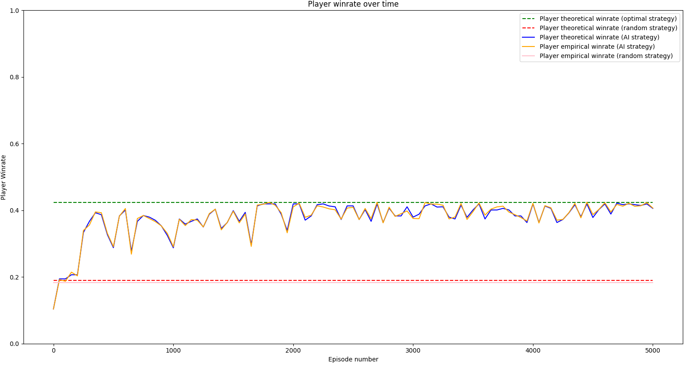

# Analyzing Skill vs Chance in Games
This is a repo where I describe a method to measure the amount of skill expression games have.

## Table of Contents
* [Motivation](#motivation)
* [Defining Skill](#defining-skill)
* [Algorithms and Experiments](#algorithms-and-experiments)
* [Results](#results)
* [Caveats](#caveats)
* [Future Work](#future-work)
* [File Descriptions](#file-descriptions)
* [Additional Resources](#additional-resources)

## Motivation
A friend of mine is a board game designer and described a thesis he had to me: 

***Games that incorporate random chance elements can allow less-skilled players to occasionally beat better-skilled players. There exists an optimal balance between the win rates of the less-skilled players and the better-skilled players, that make a game popular.***

As a consequence, games that never allow less-skilled players to beat better-skilled players, would make casual players less inclined to play those games. On the other hand, games that allow less-skilled players to beat better-skilled players too often would give the impression to the players that their choice of actions have little to no effect on the outcome of the game; i.e. the game gives players little to no **agency**.

5 days ago, my friend was pondering whether there was an objective way of quantifying this win rate balance (i.e. the chance of a less-skilled player beating a better-skilled player) for board games. If such a method existed, then one can calculate this measurement across many board games and see whether there is a trend in terms of how popular the game is compared to what the win rate balance is like. And if such a trend exists, then that could help in designing future board games that will be popular in general.

Personally I'm a big fan of games in general, and so I found the problem very interesting and started brainstorming some ideas. After a few days of coding and a few sleepless nights, I formulated a possible solution for calculating this win rate balance measurement.

## Defining Skill
The distinction between less-skilled players and better-skilled players is the win rate. Better-skilled players are expected to win more often than less-skilled players. 

To get a measure of how much skill matters in a game (i.e. how much does skill affect the win rate in a game), we need to take a look at both ends of the skill spectrum: players with maximum skill and players with no skill. 

A player with maximum skill will always pick the optimal action that maximizes their chance of winning the game; such a player therefore plays an **optimal strategy** and is deemed an **optimal player**.

A player with no skill is a little bit harder to define. In this project, I define a player with no skill as a player that implements a **random strategy** (i.e. the player always picks random actions) and is thus deemed a **random player**.

By comparing the win rates of a player with maximum skill (an optimal player ) and a player with no skill (a random player), we can measure the maximum effect that skill has in affecting the win rate in a particular game.

## Skill Score
Let's first start with single-player games as an example (e.g. blackjack, solitaire, free cell etc.).

Suppose an optimal player plays a single-player game and ends up with a 60% win rate, averaged over trillions of games. Now suppose a random player plays the same single-player game where it only pick random actions and ends up with a 20% win rate. Therefore in this specific example, we see that using a no-skill, random strategy can account for up to a third of the win rate of the optimal strategy. On the flip side, we can say that the remaining two-thirds of the optimal win rate can indeed be attributed to skill. I call this two-thirds value, the **skill score**:

where  is the skill score,  is the win rate of the random strategy and  is the win rate of the optimal strategy.

In this example, we can see that skill has some influence on the outcome of the game, but part of the outcome is also influenced by random chance.

Now imagine that instead of 20%, the random player achieves a 60% win rate as well. Then in this case, we can see that using a no-skill, random strategy can account for the total win rate of the optimal strategy. In other words, we can say that none of the games won by the optimal strategy can be attributed to skill. Therefore the skill score is 0.

Finally, if the random player achieves a 0% win rate, then we can conclude that using a no-skill, random strategy accounts for none of the win rate of the optimal strategy. And therefore, the total optimal win rate can be attributed solely to skill. In this example, we can see that the outcome of the game is influenced solely by skill, and therefore the skill score is 1.

**Intuitively, the skill score is a measurement from 0 to 1 that tells you how much skill affects the outcome of the game**. A skill score of 0 means that the outcome of the game is not determined by skill at all, whereas a skill score of 1 means that the outcome of the game is determined purely by skill. A number in-between means that the outcome of the game is determined partially by skill.

Comparing the skill scores of different games will give us an idea of which games are affected by skill more or less. If the win rate of a player with no skill (i.e. a player using the random strategy) becomes further and further away from the win rate of a player with maximum skill (i.e. a player using the optimal strategy), then intuitively the game's outcomes are more affected by skill; i.e. a higher skill score. If the win rate of a player with no skill becomes closer and closer to the win rate of a player with maximum skill, then intuitively the game's outcomes are less affected by skill; i.e. a lower skill score.

An example of a game with a skill score of 0 is guessing a coin flip; the win rate of the random strategy is 50%, which is also the win rate of the optimal strategy.

Note: the win rate of an optimal player will always be at least equal to the win rate of the random player (in the case where the win rates are equal, that would imply that the optimal strategy for the game is the random strategy)

## Explicitly Calculating Skill Score
To calculate the skill score of a game, we need the win rate of the random strategy () and the win rate of the optimal strategy ().

### Calculating the Random Win Rate
We can calculate the win rate of the random strategy **for a given game state** by:
* considering all possible moves the player can make right now
* considering all possible future game states that will result from making all possible player moves
* repeat the first two steps on the future game states, until all the resulting game states are terminal (i.e. the game has ended)
* look at all the terminal game states and see which games have resulted in a win for the player
* for each terminal game state that resulted in a win, calculate the probability of getting to that particular terminal game state by:
	* looking at the sequence of actions and intermediate game states that we took to get from the given game state to the particular terminal game state
	* multiplying the probabilities of choosing those specific actions (from the random strategy) and the probabilities of getting to those resulting intermediate game states together
* add the probabilities of getting to each terminal game state that resulted in a win together, to get the total probability of winning the game using the random strategy from the given game state

We can then calculate the win rate of the random strategy **for the entire game** by:
* considering all possible initial game states the game can start in
* calculating the win rate of the random strategy for each possible initial game state (using the above algorithm)
* for the calculated win rate of each initial state, multiply by the probability of starting in the corresponding initial state
* add all of the win rate probabilities together to get the total probability of winning the game using the random strategy ()

### Calculating the Optimal Win Rate
Assuming we don't know what the optimal strategy is, how can we calculate the optimal win rate? We can first calculate the optimal win rate for a given state, by using the same algorithm used for calculating the random win rate for a given state, with some slight alterations. 

The difference is that when we are calculating the probability of getting to each particular terminal game state that resulted in a win, we don't multiply the probabilities of choosing the specific actions like we did for the random strategy. Given  choices for actions, the random strategy will pick to do each action  of the time, whereas the optimal strategy will always pick to do the same optimal action 100% of the time. Thus to get the probability of getting to each particular terminal game state that resulted in a win, we simply multiply the probabilities of getting to the resulting intermediate game states that eventually lead to the terminal game state.

Now given the probabilities of reaching each terminal game state that resulted in a win, we simply take the path that has the highest probability of resulting in a win. This maximum probability is the total probability of winning the game using the optimal strategy from the given game state.

Once we can calculate the optimal win rate for a given state, we can use the second algorithm described above to calculate the optimal win rates for each initial state, multiply them by the probability of each corresponding initial state occurring, and then add them together to get the total probability of winning the game using an optimal strategy ().

### Calculating Skill Score
Once we have both the random win rate () and optimal win rate (), we can calculate the skill score of the game:

## Approximating Skill Score
Explicitly calculating the skill score is a computationally expensive procedure, as it involves enumerating all possible game sequences. For more complex games like chess (with 1043 possible board positions) and Go (with 10170 possible board positions, which is more than the number of atoms in the universe), this method becomes infeasible.

Instead of explicitly calculating the win rates, we can instead use approximations via game sampling. The random win rate can be approximated by playing many games using the random strategy and seeing how many games were won, divided by the number of games played.

We'd like to do  a similar approximation to get the optimal win rate, but what if we don't know what the optimal strategy is? We can instead train an AI agent to learn an approximation of the optimal strategy, using reinforcement learning. Then  the optimal win rate can be approximated by playing many games using the AI agent's learned strategy and seeing how many games were won, divided by the number of games played.

We can then calculate an approximation to the skill score as such:

where  is an approximation of the random win rate obtained by playing many games using the random strategy, and  is an approximation of the optimal win rate obtained by playing many games using the AI agent's learned strategy.

## Single-Player Blackjack

### Game Rules
We'd like to see how the approximation of the skill score compares to the true value. We'll be using a simplified version of a single-player blackjack game as an example. The simplicity allows the calculation of the true theoretical skill score to be possible.

In this game, there is a player and a dealer. The deck consists of 8 cards numbered from 1 to 4, with two copies of each card. The player is dealt two cards and the dealer is dealt one card face-up. 

The goal of the player is to have the sum of their hand be higher than the sum of the dealer's hand. Each game, the player decides whether they want to add a card from the deck to their hand (i.e. if they want to **hit**). At any point if the sum of the player's hand is greater than 8, the player loses (i.e. the player **busts**). 

Once they don't want to hit any further, the player then passes the turn over to the dealer (i.e. the player **stays**), and then the dealer hits until the sum of their hand reaches or exceeds 6. At any point if the sum of the dealer's hand is greater than 8, the player wins (i.e. the dealer busts). 

If the sum of the dealer's hand is between 6 and 8, then the sum is compared to the sum of the player's hand. If the sum of the player's hand is higher than the sum of the dealer's hand, the player wins. Otherwise, the player loses (meaning the dealer wins ties).

### Experiment procedure
First we explicitly calculate the theoretical random and optimal win rate of this blackjack game. We then train an AI agent to learn to play this game, with the goal of maximizing its win rate. While the AI agent is training, we can periodically evaluate the win rate of its current learned strategy in two ways: explicitly calculating it using the algorithm mentioned previously, and approximating it using game sampling. 

Once the AI agent is done training, we assume that the strategy it learned is an approximation of the optimal win rate. We can then use game sampling to get an approximation of the theoretical optimal win rate using the AI agent's learned strategy. We also can get an approximation of the random win rate by sampling games using the random strategy. Once we have approximated values for both the optimal and random win rate, we can calculate an approximation of the skill score for this game.

### Experiment results

Above is a graph that plots the win rate of the AI agent's strategy as it trains, in comparison to the theoretical optimal win rate and random win rate. 

The theoretical optimal win rate is 42.381% and is denoted by the green dotted line. This represents an upper bound as the highest possible win rate a player can achieve given the rules of this game.

The theoretical random win rate is 18.899% and is denoted by the red dotted line. Under the assumption that a no-skill player uses a random strategy, this represents a lower bound as the lowest possible win rate a player can achieve given the rules of this game, if the player has a non-negative amount of skill.

Given the theoretical random and optimal win rate, we can then calculate the theoretical skill score:

The theoretical win rate of the AI agent's strategy was calculated using an algorithm similar to the one mentioned previously; we evaluate the AI agent's current strategy on all possible game states and calculate what its win rate is. These values are denoted by the blue line.

The empirical win rate of the AI agent's strategy is approximated using game sampling. 10000 games were played using the AI agent's current strategy and the win rate was approximated by dividing the number of wins by 10000 (the AI agent is not training during these games, and is merely used to evaluate its current strategy). These values are denoted by the orange line. For more complex games, calculating the theoretical win rate of the AI agent's strategy would be infeasible, so the only option would be to approximate the win rate using game sampling. Therefore we hope to see the empirical win rate closely approximate the theoretical win rate of the AI agent's strategy.

After 5000 games of training, we evaluate the win rate of the AI agent's current learned strategy as well as the win rate of the random strategy via game sampling. The empirical win rate of the AI agent's strategy is 40.84% and the empirical win rate of the random strategy is 18.3% (denoted by the pink line). 

Therefore given the empirical approximation of the random and optimal win rate, we can then calculate the approximation of the skill score:

Therefore using the empirical win rate of the AI agent's learned strategy to approximate the theoretical optimal win rate, and using the empirical win rate of the random strategy to approximate the theoretical random win rate, gives us a good approximation of the skill score.

## Algorithms and Experiments

## Results

## Caveats

## Future Work

## File Descriptions
* `one_player_blackjack / two_player_blackjack`: there are identical files in the `one_player_blackjack` and `two_player_blackjack` directory. Their functions are primarily the same except applied to the one-player blackjack game and the two-player blackjack game respectively:
	* `blackjack.py` holds the BlackJack class, that facilitates the blackjack game
	* `agent.py` holds the RLAgent class, that learns an optimal strategy using reinforcement learning (the learning algorithm is specifically Q-learning)
	* `win_probability_analysis.py` holds functions that calculate the theoretical win rates using optimal, random and AI strategies
	* `train.py` holds the training function to train AI agents to learn an optimal strategy
	* `main.py` runs the entire training procedure for the AI agents and compares the win rates of their learned strategies with the theoretical win rates of the optimal and random strategies
	* `results.txt` contains the results of the AI strategy win rates and the theoretical win rates of the optimal and random strategies
* `requirements.txt` holds all required dependencies, which can be installed by typing `pip install -r requirements.txt` in the command line
* `ideas.txt` holds my (slightly unorganized) ideas that I've brainstormed throughout working on this project, in roughly the order that I came up with them; there are many ideas in there that I explored hypothetically but never implemented

For this project, I'm using Python 3.7.11.

## Additional Resources
* [A paper detailing an alternative approach to measuring skill in games](https://www.uni-trier.de/fileadmin/fb4/prof/BWL/FIN/Veranstaltungen/duersch--Skill_and_chance_2018-03-07.pdf)